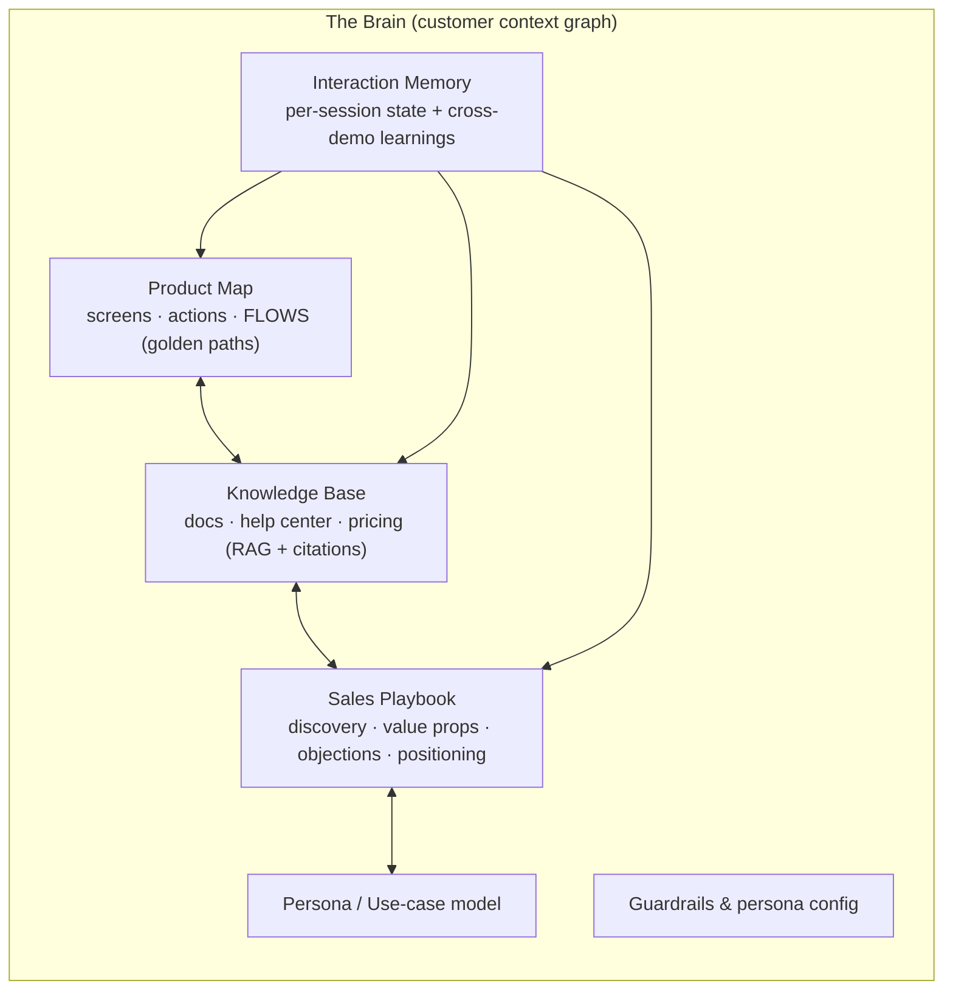
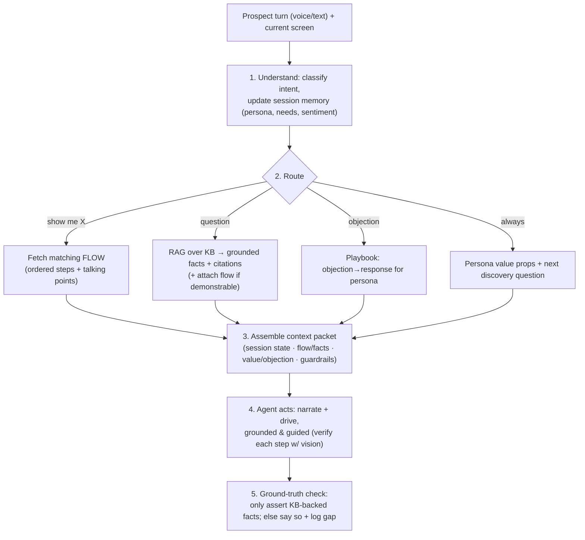

# Aidan's Brain — Design Plan

> The Brain is what turns Aidan from "an agent that clicks around and improvises" into
> "an expert that demos *this* product accurately, sells it, and gets better every time."
> This plans what it should do and how, tied to the product promise.

Companion to [`../BUILD_PLAN.md`](../BUILD_PLAN.md). Today `server/src/agent.ts` runs a static
system prompt + free-form computer use. Everything below is what replaces that with grounded,
guided behavior. The datastore (`db/`, Postgres + pgvector) is scaffolded for it.

---

## 1. The promise the Brain must satisfy

Aidan should behave like a great sales engineer:

1. **Demonstrate expertly** — run the *right* flows, reliably (not fumble around).
2. **Answer anything accurately** — from real product knowledge, with citations, never hallucinated.
3. **Sell** — discovery, tailored value, objection handling, qualification, next steps.
4. **Personalize** — adapt to the prospect's role, industry, use case, and what they just did.
5. **Improve continuously** — learn from every demo what lands, what confuses, what converts.

The Brain is the **knowledge + strategy + memory** layer that makes all five *grounded* instead
of *improvised*. Conceptually it is one **customer context graph**: product knowledge, selling
knowledge, and learned experience, cross-linked and queryable.

---

## 2. What the Brain holds (its stores)

| Store | What it is | Why it exists (which promise) |
|---|---|---|
| **Product Map** | A graph of screens (nodes: URL, purpose, elements, selectors, screenshot) and actions (edges). On top of it: **Flows** — named golden paths ("Show meeting summaries: Home→Notes→Start→…") with ordered steps, trigger intents, prerequisites/seed data, reset steps, and per-step talking points. | Reliable, expert **demonstration** (#1). Executing a known flow beats improvising clicks on latency *and* success rate. |
| **Knowledge Base** | Chunked + embedded content from marketing site, docs, help center, changelog, pricing, security. Each chunk carries source, section, **freshness**, and a **trust tier** (official doc > marketing > community). | **Accurate answers** with citations, **no hallucination** (#2). |
| **Sales Playbook** | Discovery questions, a qualification framework (need, use case, team size, current tool, authority, timeline), value props mapped to personas/pains, positioning vs. competitors, and an **objection→response** library. | **Selling** (#3). This is captured by "interviewing best sellers" — a structured intake or mining real call transcripts. |
| **Persona / Use-case model** | Taxonomy of who prospects are (role, industry, size, jobs-to-be-done, pains) that indexes the playbook and flows. | **Personalization** (#4). Infer persona → retrieve the right value props + flows. |
| **Interaction Memory** | *Short-term:* per-session working state (stated needs, inferred persona, what's been shown, open questions, qualification, sentiment). *Long-term:* transcripts + outcomes + which flows/answers landed. | Coherent demos now + **continuous improvement** (#5). |
| **Guardrails & config** | Allowlisted safe flows, never-touch areas, no destructive/irreversible actions, tone/persona, AI-disclosure, "only claim what's in the KB." | Safety + trust across all five. |

**The "graph" is the cross-linking:** a feature node ↔ its docs ↔ the flow that demos it ↔ the
value props/personas it serves ↔ the objections it answers. One query ("prospect cares about X")
then pulls *the flow to show*, *the fact to cite*, and *the value prop to say* together.

---

## 3. How the Brain is built (ingestion)

1. **Product mapping (crawl + author).** A Playwright crawler drives the product from the start
   URL, recording nodes/edges/selectors/screenshots — Aidan's existing "Eyes" snapshot already does
   the perception. Then curate: label screens, define the 3–5 golden-path **flows**, mark seed-data
   prerequisites + reset steps, write talking points. Store selectors by **role/text** (accessible),
   not brittle CSS, so flows survive UI tweaks.
2. **Doc ingestion (crawl → chunk → embed).** Scrape site/docs/help-center/changelog → heading-aware
   chunks → embeddings → pgvector, with trust tier + freshness. Re-crawl on a schedule; diff for
   changes; flag flows whose UI moved.
3. **Playbook capture (interview + curate).** Structured intake wizard for sellers (or transcribe
   real sales calls / mine won-lost decks) → discovery questions, value props, objections,
   positioning, tagged by persona/use-case.
4. **Fusion.** Build the cross-links (feature ↔ doc ↔ flow ↔ value prop ↔ objection). This is what
   makes it a graph rather than three disconnected stores.

---

## 4. How the Brain is used at demo time (the core loop)

Each prospect turn, a **retriever/router** assembles a **context packet** and hands it to the
agent loop (`agent.ts`), replacing today's static prompt:

Design principles that make this work:

- **Flow-first for demos.** Prefer executing a *known flow* (fast, reliable, verify-with-vision at
  each step, adapt on mismatch) over free-form computer use. Fall back to free-form only when no
  flow matches. **This is the single biggest reliability + latency win.**
- **Hybrid retrieval.** Vector similarity **+** metadata filters (persona, feature, trust tier,
  freshness) **+** graph traversal (from the matched feature to its flow/value props), then rerank
  for relevance × trust × freshness.
- **Grounded + cited.** Every factual claim is traceable to a source; if the KB has no answer, Aidan
  **says so and offers follow-up** (honesty beats hallucination) and logs the gap.
- **Budget-aware.** Retrieve → rank → compress so only the most relevant slices enter context —
  keeping per-turn latency and cost down.

---

## 5. The learning loop ("improves with every interaction")

Two speeds:

- **Within-session (live):** working memory adapts as the prospect talks and clicks — persona
  inference sharpens, shown-features tracked, the "I see you're trying to draft an email…" reaction.
- **Across-session (offline, curated, versioned):**
  1. **Capture** every session: transcript, intents, flows run + per-step success, answers given +
     apparent satisfaction, qualification, outcome (engaged / qualified / booked / dropped + *where*).
  2. **Signals:** per-flow success rate, answer helpfulness, **KB-miss list** (unanswered questions),
     objection frequency + which responses converted, drop-off points, value props that correlate
     with engagement.
  3. **Improve:** fill KB gaps (cluster misses → draft FAQ / prompt vendor), **repair broken flows**
     (UI changed → re-map), promote winning value props/objection responses, tune per-persona
     personalization, A/B the narrative arc.
  4. **Safely:** aggregate learnings are **reviewed and gated** before changing behavior (never learn
     a hallucination); per-prospect data is **isolated** (privacy — matches Sable's "no training on
     customer data"); improvements are **versioned** for rollback.

---

## 6. Data model additions (Postgres + pgvector)

Building on `db/schema.sql`:

- `product_map_nodes` / `product_map_edges` *(stubbed)* + **`flows`** (ordered steps, trigger intents, prerequisites, reset, talking points).
- `doc_chunks` *(stubbed: text, embedding, source, + add trust_tier, freshness)*.
- `personas`; `playbook_items` (kind: discovery | value_prop | objection | positioning; persona/use-case tags).
- `sessions` *(transcript, actions, qualification)* + **`session_memory`** (live working state).
- `interaction_signals` / aggregates (flow success, answer helpfulness, KB gaps).
- `improvements` (versioned proposed changes + review status).
- link tables: feature ↔ doc ↔ flow ↔ value_prop ↔ objection.

---

## 7. How it plugs into the current code

- **`agent.ts`:** add `const packet = await brain.retrieveContext(turn, sessionMemory)` **before**
  each `brain.step()`, and inject the packet (flow steps / grounded facts + citations / value props /
  session state / guardrails) into the messages. Execution becomes **guided-with-fallback** instead
  of pure free-form.
- **`brain/`** (new): retrieval + intent router + session memory.
- **`ingest/`** (new): the crawler + doc scraper + playbook intake that build the stores.
- **`db/`:** the stores above.

---

## 8. Build it in slices (each independently valuable)

| Slice | Delivers | Effort / risk |
|---|---|---|
| **B1 — Grounding (RAG)** | Ingest docs → KB; retrieval into the agent → answers are accurate + cited, no hallucination | Low effort, biggest accuracy win |
| **B2 — Guided demos (flows)** | Crawl product map; author 3–5 golden-path flows; flow-first execution | Biggest reliability + "wow" win |
| **B3 — Selling** | Persona inference, discovery/qualification, value props, objection handling, personalization | Medium |
| **B4 — Memory + learning** | Session memory, logging, signals, gap-filling, flow repair, versioned improvements | Ongoing |

Recommended order: **B1 → B2 → B3 → B4**. B1+B2 alone make demos accurate and reliable.

---

## 9. How you'll know it works (metrics)

- **Demo success rate** (flows complete without failing) · **answer groundedness** (cited, zero
  hallucinations) · **question coverage** (% answered from KB) · **qualification capture rate** ·
  **engagement / conversion** · **per-turn latency** · **KB-gap closure over time** · **flow-repair
  turnaround**.

These are exactly the levers that make Aidan feel like an expert instead of an improviser — which is
the whole promise.
