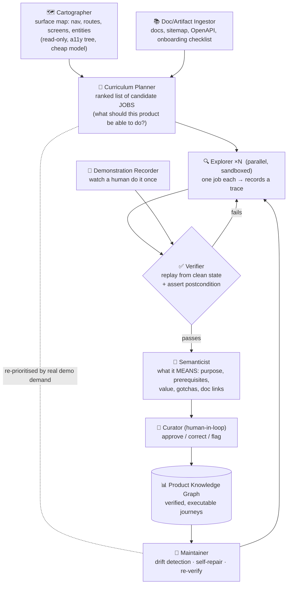

# Product Mapper — autonomously learning a new product into a knowledge graph

> Goal: point the system at a product it has never seen, let it learn every journey, and store that
> as a connected graph — so later it knows how the product moves from step to step, what each
> capability *means*, and exactly *how* it executes.

**The core reframe: don't map pages — induce a _verified skill library_, stored as a graph.**
A page graph ("Screen A --click Save--> Screen B") is nearly useless for guiding a user. What guides
a user is a **journey**: *"To send an invoice: Billing → New → pick customer → amount → Save → Send.
Requires: a customer exists. Result: status becomes Sent."* The unit of knowledge is the **job**, not
the screen.

This matches where the research has landed: **Voyager** (exploration + execution feedback +
self-verification + curriculum → a growing library of *executable* skills), **SkillWeaver** (web
agents self-improving by discovering and honing skills), **ALLOY** (reusable workflows from *user
demonstration*), **Record & Replay** (trace → structured "experience" → replay), and **SkillGraph**
(evolving skill graphs). We are not inventing a new paradigm — we're applying the proven one.

---

## 1. Why the obvious approach fails

"Log in, click everything, record the graph" breaks on all seven of these:

| Failure | Why it kills you |
|---|---|
| **Combinatorial explosion** | Real SaaS has effectively infinite states (filters × sorts × modals × form values). Exhaustive crawling never terminates. |
| **Destructive actions** | Autonomous clicking *will* delete records, send emails, invite users, cancel subscriptions. This is the #1 risk. |
| **State pollution** | Exploration litters the tenant with junk ("test123" everywhere), poisoning later demos. |
| **Semantic vacuum** | Topology ≠ meaning. Knowing B follows A tells you nothing about *what the feature is for*. |
| **Session loss** | One click on "Log out" (or an external link) ends the crawl. |
| **Non-determinism** | The same click behaves differently depending on data state — recorded paths silently rot. |
| **Cost & noise** | A vision call per state, over thousands of states, for mostly worthless topology. |

**Conclusion: exhaustive crawling is the wrong frame.** Goal-directed exploration is the right one.

---

## 2. The better way: three knowledge sources, cheapest first

Autonomy is the *last* resort, not the first. Most of the map is available for free.

### Source 1 — Free structure (near-zero cost, do this first)
Harvest what the product already tells you: **nav labels, route manifests / sitemap, empty-state
CTAs, onboarding checklists, i18n string tables, OpenAPI/GraphQL schemas, help-center docs,
changelog**. This yields the **vocabulary and the candidate job list** — the product's *own opinion*
of what matters — with no clicking at all. An onboarding checklist is literally a list of the
journeys the vendor thinks are important.

### Source 2 — Human demonstration (highest quality per unit of effort)
Record **one** real seller/CSM doing the demo, or a user completing a task. One clean demonstration
yields a *verified, semantically-labelled* journey that autonomous exploration might never find
(hidden shortcuts, the "right" way, the narrative order). This is the ALLOY result, and it is by far
the best value-for-risk. **Recommended as the primary path for the core 5–15 journeys.**

### Source 3 — Autonomous goal-directed exploration (fills the gaps)
Only now does the agent explore — and never "randomly." It takes a **specific job** from the
curriculum ("create an invoice"), attempts it in a sandbox, and records the trace. Curriculum-driven,
verified by replay, exactly as in Voyager/SkillWeaver.

> **The hybrid is strictly better than pure autonomy**: ~80% of the value at ~20% of the risk, and it
> degrades gracefully — if exploration fails on a journey, you still have docs + demonstrations.

---

## 3. Agent organization



| Agent | Job | Model tier |
|---|---|---|
| **Cartographer** | Breadth-first surface map from the accessibility tree. Read-only; never mutates. | cheap / no vision |
| **Doc Ingestor** | Pulls free structure + docs (already built in `knowledge/ingest.ts`) | none |
| **Curriculum Planner** | Turns map + docs into a *ranked list of jobs to learn* | mid |
| **Explorer** ×N | Attempts ONE job in an isolated sandbox; records the trace. **Parallel = speed.** | vision |
| **Verifier** | Replays the journey from a clean state, asserts the postcondition. Mostly deterministic. | cheap / none |
| **Semanticist** | Writes the *meaning*: purpose, prerequisites, business value, links to docs | mid |
| **Curator** | Human approval gate — required for destructive or business-critical claims | human |
| **Maintainer** | Scheduled re-verification, UI-drift detection, self-repair | mixed |

**Why this split:** it separates *cheap breadth* (Cartographer) from *expensive depth* (Explorer),
puts a **deterministic gate** (Verifier) in front of the graph so nothing unproven gets in, and
isolates the one step that genuinely needs a human (Curator).

---

## 4. Safety: structural, not prompted

You cannot solve this with "please don't delete anything" in a prompt.

1. **Sandbox tenant only.** Never a production account. Ideally a resettable seeded tenant.
2. **Destructive-verb interlock.** Classify every candidate action; block `delete / remove / cancel / deactivate / send / pay / invite / publish / archive` unless explicitly allowlisted for that journey.
3. **Snapshot & restore between episodes.** Playwright `storageState` + a tenant reset (or per-episode fresh account) so exploration can't pollute the next run.
4. **Never-touch list.** Logout, billing, account settings, external domains — hard-blocked at the LiveBox layer.
5. **Budgets.** Max steps/journey, max wall-clock, max spend. Explorers die rather than wander.
6. **Irreversibility check before commit.** If a step can't be undone, it needs Curator sign-off.

---

## 5. What actually goes in the graph

The key design choice: **journeys are stored as executable, parameterized programs** (Voyager's
"skill library of executable code") — not prose, not raw click coordinates.

```
Journey: create_invoice(customer, amount)
  goal:         "Create a draft invoice for a customer"
  capability:   Invoicing
  entities:     [Invoice, Customer]
  preconditions:[ customer_exists ]
  steps: [
    { action: click,  target: {role: link, name: "Billing"},   expect: url~/billing },
    { action: click,  target: {role: button, name: "New invoice"}, expect: dialog "New invoice" },
    { action: fill,   target: {role: combobox, name: "Customer"}, value: $customer },
    { action: fill,   target: {role: textbox,  name: "Amount"},   value: $amount },
    { action: click,  target: {role: button, name: "Save"} }
  ]
  postcondition: "invoice appears in list with status Draft"   ← asserted by Verifier
  evidence:      [screenshot, doc: "Billing > Invoices"]
  status:        verified | unverified | broken
  reliability:   0.98   (rolling replay success rate)
```

**Node types:** Screen · Entity · Capability · **Journey** · Step · Condition · Evidence
**Edge types:** `transitions_to` · `achieves` · `operates_on` · `requires` (journey→journey!) ·
`documented_by` · `variant_of` · `part_of`

Two properties that make it work:
- **Selectors are role/text-based** (accessibility-first), never brittle CSS/XPath — journeys survive redesigns.
- **Journeys compose.** `send_invoice` `requires` `create_invoice` `requires` `create_customer`. The graph can then *plan* multi-step goals it was never explicitly taught.

---

## 6. Verification is the whole ballgame

> **Nothing enters the graph until it has been replayed successfully from a clean state.**

Explore → hypothesize journey → **replay** → assert postcondition → only then commit. This single
rule buys you: determinism (catches flaky/data-dependent paths), truth (no hallucinated features),
and a live health metric (`reliability` score per journey). It's also cheap — replay is deterministic
DOM automation, with vision used only as a checkpoint, not as the driver.

Re-run verification on a schedule → **UI drift detection**: when a journey starts failing, the
product changed, and the Maintainer re-explores just that journey.

---

## 7. Coverage — knowing what to learn, and when to stop

You never map "everything." Rank the curriculum by:
1. **Nav prominence** — top-level nav is top-priority by construction
2. **Onboarding checklist / empty-state CTAs** — the vendor's own view of the critical path
3. **Doc frequency** — what the documentation spends its words on
4. **↩ Real demo demand** — *what prospects actually ask for*, from the B4 learning signals already being logged

That last one closes the loop beautifully: **the demos tell the mapper what to learn next.** Unanswered
questions and failed requests become the exploration curriculum. The product map improves *because*
it's being used.

---

## 8. Cost

Mapping is a **one-time, amortized** cost — not per-demo — so you can afford thoroughness.

| | Estimate |
|---|--:|
| Surface map (a11y tree, no vision) | ~50–100 cheap calls |
| ~30 jobs × ~15 steps, DOM-driven + vision checkpoints | ~300–500 calls |
| **Total per product (initial)** | **≈ $1–5** |
| Maintenance (weekly re-verify) | cents |

Compare to the alternative: a solutions engineer spending **days** documenting demo flows. The
economics aren't close — and unlike the human, the graph self-verifies and self-repairs.

---

## 9. Build order

| Milestone | Delivers | Risk |
|---|---|---|
| **M1 — Free structure** | Doc/sitemap/nav ingestion → candidate job list + surface map. *No autonomy, no risk.* | ▁ |
| **M2 — Demonstration capture** | Record a human once → verified journeys for the core flows. **Biggest quality win.** | ▁ |
| **M3 — Guided autonomy** | Explorer + Verifier + safety interlocks; fills gaps from the curriculum | ▄ |
| **M4 — Self-maintenance** | Scheduled re-verification, drift detection, self-repair, demand-driven curriculum | ▂ |

**Recommendation: M1 → M2 first.** They deliver most of the value with essentially no risk of
destructive autonomy, and they produce the training signal (verified journeys) that makes M3's
exploration far more likely to succeed. M3 without M1/M2 is flailing in the dark.

---

## 10. How this plugs into what's already built

- `knowledge/store.ts` already has `mapNodes`/`mapEdges` + `flows` — **flows ARE journeys**; extend the schema with steps/conditions/reliability.
- `knowledge/ingest.ts` `crawlMap()` is the Cartographer's skeleton (surface map) — today it's link-following; it becomes a11y-tree-based.
- `livebox.ts` already provides the action space + `describeAt`/`pageSignature` — the Explorer drives it, and `pageSignature` is exactly the postcondition primitive the Verifier needs.
- The B4 signals (`kbGaps`, `frictionPoints`) become the **curriculum** for what to explore next.
- Verified journeys feed straight into flow-first execution and Intent Rescue — better map, better demos, better rescues.
