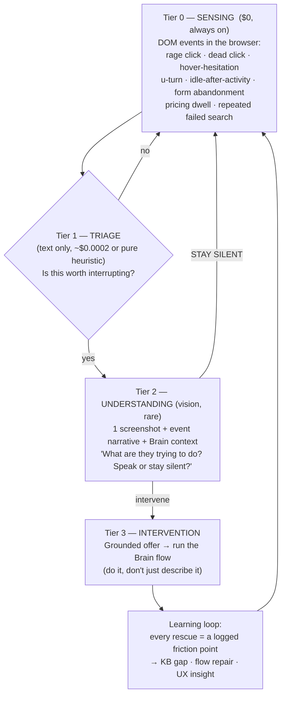

# Vision / "Eyes" — Market Gap, Cost-Benefit, and the Right Capability to Build

> Question: what doesn't exist today that vision would unlock for conversion — and does the cost
> exceed the benefit? Short answer: **the opportunity is real and large; the cost concern is aimed at
> the wrong constraint.** Compute is cheap at demo volumes. Precision and latency are the real limits,
> and the architecture below optimizes for those (and gets ~200× cheaper as a side effect).

---

## 1. What exists today (and why it leaves the gap open)

| Category | Examples | Detects struggle? | Acts in the moment? | Understands *intent*? | Can *do* it for you? |
|---|---|:--:|:--:|:--:|:--:|
| Session replay / analytics | FullStory, Hotjar, Contentsquare, Quantum Metric | ✅ | ❌ *(retrospective — a PM sees it next week)* | ❌ | ❌ |
| Product tours / DAP | Pendo, Appcues, WalkMe | ❌ | ✅ *(but pre-authored rules)* | ❌ | ❌ *(points at things)* |
| In-app AI copilots | Product Fruits, Intercom | ❌ | ⚠️ *(reactive — user must ask)* | ⚠️ | ❌ |
| Conversation intelligence | Gong, Chorus | ❌ *(analyzes calls, not screens)* | ❌ | ⚠️ | ❌ |
| **Aidan + Eyes (the gap)** | — | ✅ | ✅ | ✅ | ✅ |

**The whitespace is the combination, not any single column.** The industry has spent a decade
learning to *record* frustration and a decade learning to *fire rules*. Nobody closes the loop:
understand what the user was **trying** to do, in the moment, and **complete it for them**.

Evidence the signals matter:
- Rage-click sessions convert at **0.9% vs 4.1%** for smooth sessions — a **~4.5× collapse**.
- Rage clicks appear in **4–6% of all web sessions** (FullStory, across 1.4B sessions) — common enough to matter, rare enough to be affordable to act on.
- Doing beats describing: **+20% activation (Aircall)** and **+18% (Sellsy)** when software *completes the work* instead of explaining it — which is precisely Aidan's advantage: it already has hands.

The critical asymmetry: **session replay proves these signals predict lost revenue, but every existing
tool acts on them too late.** The value isn't in the detection — that's solved and commoditized. The
value is in the *seconds* between struggle and abandonment.

---

## 2. The capability that doesn't exist: **Intent Rescue**

> Detect a silent struggle in real time → understand what they were trying to achieve →
> offer to do it → and actually do it.

Today, a confused user just leaves. Silently. Nobody knows why until someone reviews a replay. That
silent abandonment is the single largest leak in any product-led journey, and it is *invisible* to
every tool that acts in real time.

Three moments where this converts:

| Moment | Trigger | Intervention | Why it converts |
|---|---|---|---|
| **Silent struggle** | rage/dead click, hesitation, u-turn, idle-after-activity | "Looks like you're trying to X — want me to show you?" then **run the flow** | Recovers a session that was about to be lost at 0.9% odds |
| **Buying signal** | dwell on pricing/upgrade/integrations | Engage at peak intent, answer grounded, qualify | Highest-value 20 seconds in the entire journey; today nothing happens |
| **Unspoken objection** | searches for a missing feature, hunts for a competitor integration | Surface the real answer / the workaround before they conclude "it can't do it" | Kills a deal-losing misconception while it's still forming |

---

## 3. Cost-benefit: the real math

Model: `gpt-5.6-luna` — **$1.00/1M input, $6.00/1M output**. One observation ≈ 1,200 image tokens +
~800 context + ~120 out ≈ **$0.0027**.

### The naive approach (poll the screen on a clock)

| Cadence | Calls / 10-min session | Cost / session |
|---|--:|--:|
| every 2s | 300 | **$0.81** |
| every 1s | 600 | $1.62 |
| 15 fps | 9,000 | ~$24 |

### The trigger-gated approach (screenshot only when a signal fires)

Detection is **free** (DOM events). Vision runs only at the moment of truth — ~1–2 calls in a
*struggling* session, **zero** in a smooth one:

| | Cost / session |
|---|--:|
| Trigger-gated | **~$0.004** |
| **Reduction vs naive** | **~200×** |

### Does cost exceed benefit? No — not remotely.

At B2B demo volumes (say **500 demos/month**), against a qualified B2B lead worth **$100–500+**:

| Approach | Monthly compute | Break-even |
|---|--:|---|
| Naive continuous | **$405** | ~1–4 extra qualified leads/month |
| Trigger-gated | **$2** | *statistical noise* |

**Even the wasteful version pays for itself on a single recovered deal.** The honest conclusion:
**compute cost is not the binding constraint** — it's off by 2–3 orders of magnitude from the value
at stake. Optimizing pennies here is optimizing the wrong variable.

### The constraints that actually bind

1. **Latency.** A vision call is 1–4s. A polling loop is *structurally* late — it fires on a clock, not on the event. Trigger-gating is not just cheaper, it's **faster to the right moment**.
2. **False positives (the real cost).** Interrupting a *happy* user is worse than silence — it damages trust and suppresses conversion. This risk is **asymmetric**: a missed rescue costs one session; an annoying agent poisons every session. Precision > recall.
3. **Privacy.** Behavioral watching needs explicit disclosure, and is far safer in a demo sandbox than in a customer's production data.
4. **Context bloat.** Screenshots accumulate in history and slow every later turn (already mitigated by pruning to the latest frame).

**Key economic property: cost scales with struggle, not with time.** A user having a great time costs
**$0**. You only spend money exactly when there's revenue at risk. That is the correct shape for this
business.

---

## 4. The replanned architecture — tiered, precision-first

**Design rules that make it work:**

1. **Never screenshot on a clock.** Only at a trigger. This fixes cost *and* latency *and* precision at once.
2. **Silence is a first-class output.** The model must be able to return "say nothing," and should — most of the time. Enforce a hard budget (e.g. **≤1 interjection per 2 minutes**, only above a confidence threshold).
3. **Mouse behavior must be sent as text, not pixels.** The cursor **isn't in the screenshot** (Playwright/CDP don't render it), and a static frame can't convey motion or hesitation anyway. Send a narrative: *"hovered 'Export' 3s, clicked twice, screen unchanged."*
4. **Semantic enrichment before the model.** Resolve *what* was touched (`elementFromPoint` → "button 'Export'"), never raw coordinates — `(0.42, 0.31)` is meaningless to a model.
5. **Intervene by doing.** The differentiator vs. every tooltip product: offer to *run the flow*, using the Brain's golden paths.

---

## 5. Sequencing to capture the market quickly

| Phase | Build | Why first |
|---|---|---|
| **V1 — Intent Rescue** *(days)* | Tier 0 sensing + rage/dead-click + hesitation → vision → grounded offer → run the flow | Highest signal-to-effort. Near-zero cost. **Immediately demoable** — and it's the demo that *sells Sable itself*: show a prospect struggling, and Aidan catching it. |
| **V2 — Buying-signal capture** | Pricing/upgrade dwell → engage at peak intent + qualify | The single highest-commercial-value moment in the journey; today literally nothing happens there. |
| **V3 — Precision tuning** | Interjection budget, confidence thresholds, A/B harness | Protects against the asymmetric false-positive risk; makes ROI *provable to customers* — itself a GTM weapon. |
| **V4 — The flywheel** | Every rescue → KB gap / flow repair / UX insight back into the Brain | **The moat.** Rule-based tours can't accumulate this. Each demo makes the next one better, per-customer. |

**Metrics to run it on:** interjection **precision** (accepted vs dismissed), rescue→completion rate,
conversion lift vs. control, **and a guardrail: abandonment *after* an interjection** (catches
annoyance early).

---

## 6. Bottom line

- **The market gap is real:** everyone detects friction *retrospectively* or acts on *dumb rules*. Nobody understands intent in the moment and finishes the job. Aidan already has vision + hands + (now) a Brain — it is 80% of the way to the thing that doesn't exist.
- **Cost is a red herring:** ~$0.004/session trigger-gated (~$0.81 even if built naively) against leads worth $100–500. Break-even is a fraction of one deal.
- **Spend the engineering on precision, not on pennies:** the expensive mistake is an agent that interrupts a happy user, not an agent that takes a screenshot.
- **Build V1 (Intent Rescue) first** — it's days of work, it's the wedge, and it's the demo that closes.
